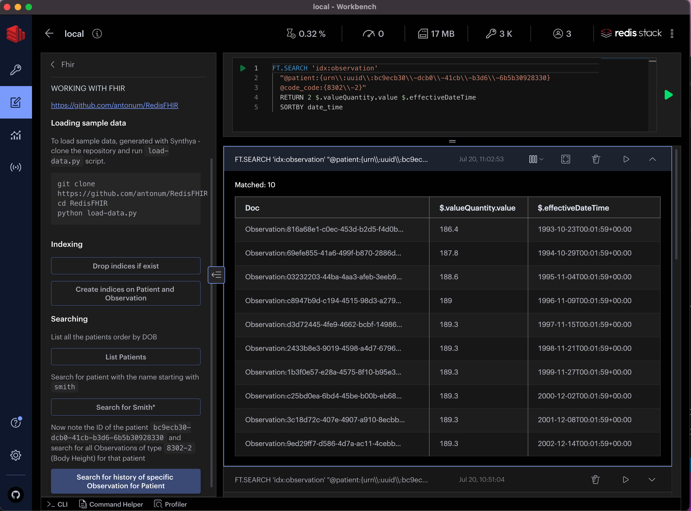

# REDIS FHIR

Using RedisJSON and RediSearch to work with FHIR®.

FHIR is a standard for health care data exchange, published by HL7®. 

https://hl7.org/FHIR/

## Prerequisites

This demo uses Redis with RedisJSON and RediSearch modules. The easiest way to try it locally is to use [Redis Stack](https://redis.io/docs/stack/)

You can also use Free Forever 30MB database in the [Redis Cloud](https://app.redislabs.com/#/login) - make sure you selecting Redis Stack or at least RediSearch+RedisJSON modules when creating your database.

`data/` directory contains syntetically generated FHIR data for 16 patient. You can use [Synthea](https://github.com/synthetichealth/synthea) tool to generate more if needed.

It is also recommended that you install [RedisInsight](https://redis.com/redis-enterprise/redis-insight/) tool and load this tutorial in there (see instructions below).

## Load Data

Clone ther repo if not already done so:
```
git clone https://github.com/antonum/RedisFHIR
cd RedisFHIR
``` 
The following command would load content of the ./data folder into Redis.
```
python load-data.py
```

Data is loaded into keys, corresponding to the individual resources.

Try redis CLI:
```
$redis-cli
127.0.0.1:6379> keys Patient*
 1) "Patient:039c2f2e-6bc6-4bb4-9cc1-1316357601c4"
 2) "Patient:38087a40-35ba-4756-8dd1-4c6bce9a33e4"
 3) "Patient:ce7880f5-cb59-4a62-9eea-00ac81badb38"
 ...
```
## Indexing the data

Patient
```
FT.CREATE idx:patient 
  ON JSON
    PREFIX 1 "Patient:"
  SCHEMA
    $.name[0].family AS name_family TEXT SORTABLE
    $.name[0].given[0] AS name_given TEXT SORTABLE
    $.gender AS gender TAG
    $.birthDate AS birthday TEXT SORTABLE
```

Observation
```
FT.CREATE idx:observation  
  ON JSON
    PREFIX 1 "Observation:"
  SCHEMA
    $.subject.reference AS patient TAG
    $.encounter.reference AS encounter TAG
    $.code.coding[0].system AS code_system TAG
    $.code.coding[0].code AS code_code TAG
    $.effectiveDateTime as date_time TEXT SORTABLE
```
Index information
```
FT.INFO "idx:observation"
```
Search for patient with the name starting with `smith`
```
FT.SEARCH idx:patient smith*
```

Search all Observations of type `8302-2` (Body Height) for the patient
`bc9ecb30-dcb0-41cb-b3d6-6b5b30928330` (Micah Smith)
```
FT.SEARCH 'idx:observation' 
  "@patient:{urn\\:uuid\\:bc9ecb30\\-dcb0\\-41cb\\-b3d6\\-6b5b30928330} 
  @code_code:{8302\\-2}" 
  RETURN 2 $.valueQuantity.value $.effectiveDateTime
  SORTBY date_time
```

## Adding tutorial to RedisInsight

You can add FHIR Tutorial, based on this repo to the RedisInsight v2.



The following commands should add this Redis FHIR tutorials to the list of tutorials, avaliable in RedisInsight. Note: these steps are tested on Mac/Bash and requres `jq`.

```bash
#copy tutorial .md file to the RedisInsight directory
cp RedisInsight/working_with_FHIR.md ~/.redisinsight-v2/tutorials/fhir/working_with_FHIR.md
#make a backup copy of the `tutorials.json` 
cp ~/.redisinsight-v2/tutorials/tutorials.json ~/.redisinsight-v2/tutorials/tutorials.json.bak
#add Redis and FHIR tutorial to the tutorials.json
jq '.tutorials.children += {"redis-fhir": input}' \
  ~/.redisinsight-v2/tutorials/tutorials.json.bak \
  RedisInsight/tutorials_fhir.json \
  > ~/.redisinsight-v2/tutorials/tutorials.json
```

Try to switch between `Workbench` and `Browser` view in RedisInsight in order for the changes to take effect. If it doesn't help - restart it.

### Adding tutorial to RedisInsight (manual steps)

Use only if steps above fail.

Then add the content of the `RedisInsight/tutorials_fhir.json` file to the `~/.redisinsight-v2/tutorials/tutorials.json` file on your local machine as `$.tutorials.children.redis_FHIR` node. See [example here](RedisInsight/tutorials_json.png).

You can also replace your existing `~/.redisinsight-v2/tutorials/tutorials.json` with provided `RedisInsight/tutorials.json`, but **it would override your existing local `tutorials.json` and erase all the changes made prior and/or break your existing RedisInsight installation. Proceed with caution!!!!**

```bash
cp RedisInsight/tutorials.json ~/.redisinsight-v2/tutorials/tutorials.json
```

